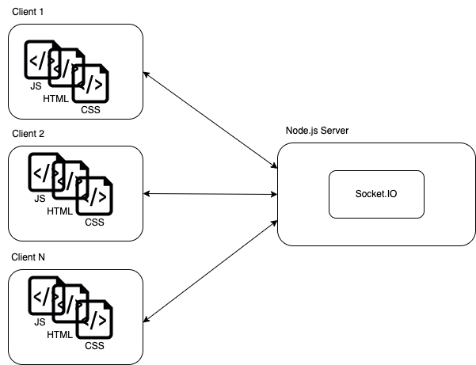
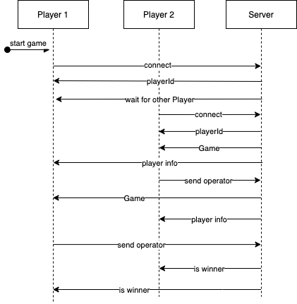

## Game of Three - Challenge

When _Player One_ starts the game, a whole number is generated. If a second player joins the game, _Player Two_ gets the number and can choose to a number between {-1,0,1} as an operator to get a number divisible by 3. The number is divided by 3 and the result is then sent to _Player One_. _Player One_ repeats the steps. The winner is the player who calculates 1.

### Architecture 

Base architecture af the game is a Client-Server setup. The server holds the main game logic and clients can connected to the Server via web socket. On the server is a Socket.IO Server running, which allows real time network communication. 

Basic event flow of the architecture:

### Used Packages

-   [Express](https://expressjs.com): Node.JS web application framework
-   [CORS](https://github.com/expressjs/cors): Express middleware to enable CORS
-   [Socket.IO](https://socket.io/): TCP-based socket API
-   [winston](https://github.com/winstonjs/winston): NodeJS Logger
-   [ts-node-dev](https://github.com/wclr/ts-node-dev): used for development

### Run app in dev mode

-   run `npm install` to install required packages
-   run `npm run dev` to start app with ts-node-dev

the game is reachable at [localhost:3000](http://localhost:3000)

### Run app

-   run `npm install` to install required packages
-   run `npm run build` to build and create target
-   run `npm run start` to start app
